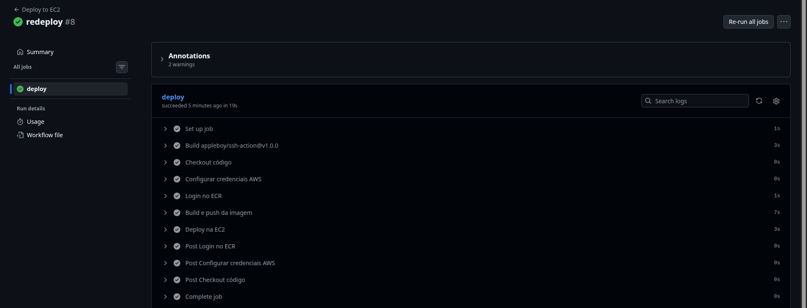
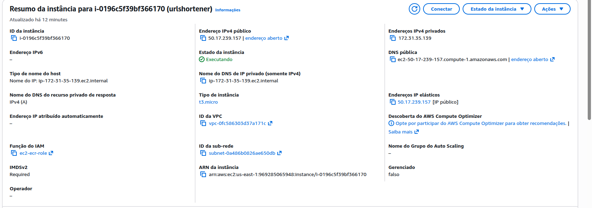
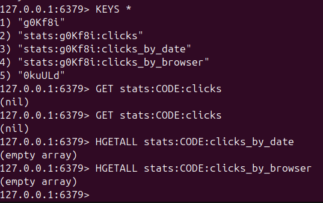

# url-shortener-aws

Encurtador de URLs com painel de analytics, construído com foco em práticas de DevOps. O projeto cobre desde o desenvolvimento da API até o deploy automatizado em nuvem com pipeline de CI/CD.

## Sobre o projeto

A aplicação permite encurtar URLs e rastreia métricas de acesso em tempo real: total de cliques, cliques por data e cliques por browser. O objetivo principal foi aplicar uma stack DevOps completa em um serviço funcional e mensurável.

## Stack

**Aplicação**
- Node.js + Express
- Redis (contagem de cliques e armazenamento de URLs)
- Docker + Docker Compose

**Infraestrutura**
- AWS EC2 (t3.micro) — servidor de produção
- AWS ECR — registro de imagens Docker
- AWS IAM — gerenciamento de permissões

**CI/CD**
- GitHub Actions — pipeline de build e deploy automático

## Arquitetura

```
Push no GitHub
      ↓
GitHub Actions
      ↓
Build da imagem Docker → Push para o ECR
      ↓
SSH na EC2 → Pull da imagem → Restart do container
```

## Funcionalidades

- `POST /shorten` — recebe uma URL longa e retorna um código curto
- `GET /:code` — redireciona para a URL original (HTTP 302)
- Autenticação via API Key no header `Authorization: Bearer <token>`
- Validação de URLs com o constructor nativo `URL` do JavaScript
- Analytics por clique: total, data e browser — armazenados no Redis com `INCR` e `HINCRBY`

## Como rodar localmente

**Pré-requisitos:** Docker e Docker Compose instalados.

```bash
# Clone o repositório
git clone https://github.com/JG-Souza/aws-lab1
cd aws-lab1

# Configure as variáveis de ambiente
cp .env.example .env
# Edite o .env com seus valores

# Suba os containers
docker compose up --build
```

## Como usar

**Criar um link curto:**
```bash
curl -X POST http://localhost:3000/shorten \
  -H "Content-Type: application/json" \
  -H "Authorization: Bearer SEU_TOKEN" \
  -d '{"url": "https://www.google.com"}'
```

**Exemplo de Resposta:**
```json
{
  "originalUrl": "https://www.google.com/",
  "newUrl": "g0Kf8i"
}
```

**Acessar o link curto:**
```
http://localhost:3000/g0Kf8i → redireciona para https://www.google.com
```

## Variáveis de ambiente

Consulte o `.env.example` para ver todas as variáveis necessárias:

```env
ADMIN_TOKEN=    # Token de autenticação da API
REDIS_PASSWORD= # Senha do Redis
REDIS_HOST=     # Host do Redis (use "cache" no Docker Compose)
```

## Pipeline CI/CD

A cada push na branch `main`, o GitHub Actions executa automaticamente:

1. Checkout do código
2. Autenticação na AWS
3. Login no ECR
4. Build da imagem Docker
5. Push da imagem para o ECR
6. SSH na EC2 e deploy do novo container



## Infraestrutura AWS

- **EC2 t3.micro** rodando Amazon Linux 2023
- **Elastic IP** fixo para não perder o endereço ao reiniciar a instância
- **Security Group** com regras para SSH (porta 22), HTTP (porta 80) e aplicação (porta 3000)
- **IAM Role** `ec2-ecr-role` com permissão `AmazonEC2ContainerRegistryReadOnly` anexada à instância



## Analytics no Redis

Cada acesso ao link curto registra:

```
stats:<code>:clicks            → total de cliques (INCR)
stats:<code>:clicks_by_date    → cliques por dia (HINCRBY)
stats:<code>:clicks_by_browser → cliques por browser (HINCRBY)
```


